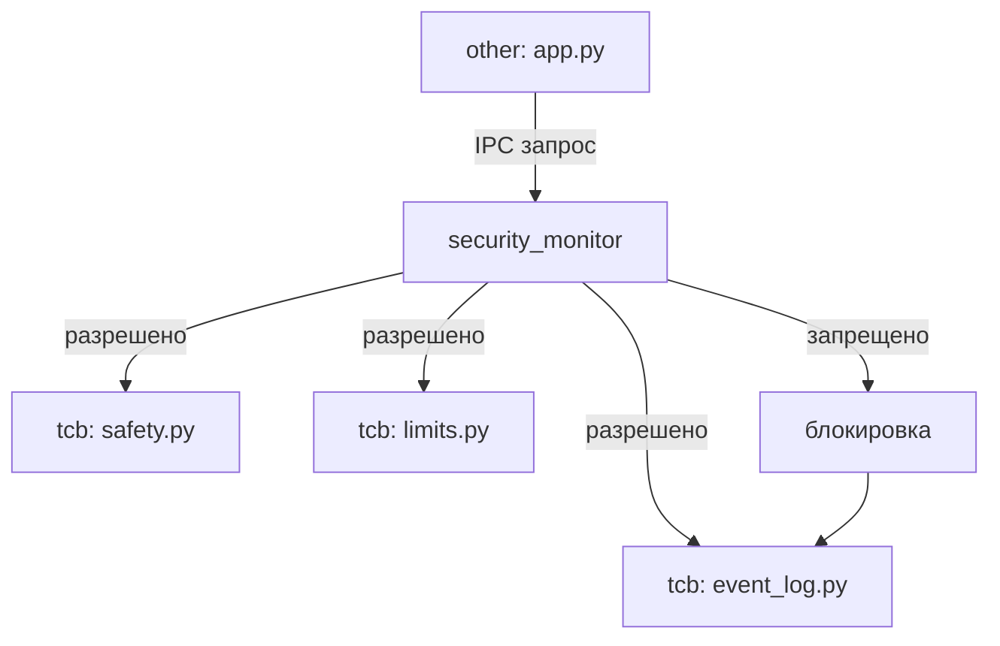

# Отчёт о решении АБУ

## Архитектура

Решение разделено на два домена:

- `abu/tcb/` — доверенная вычислительная база (ДВБ): `event_log`, `safety`, `limits`, `security_monitor`
- `abu/other/` — недоверенный код: `ai_engine`, `app`

Все обращения из `other` к `tcb` проходят через монитор безопасности (`security_monitor.py`),
реализующий шаблон А.2 ГОСТ Р 72118-2025 «Раздельное принятие и применение решений о безопасности».

## Цели безопасности

| ID | Цель | Реализация |
|----|------|-----------|
| SG_ADS_Authorized_critical_commands | Только авторизованные команды | `security_monitor.py` + `ipc_policies.json` |
| SG_ADS_Controlled_operations | Соблюдение критичных ограничений | `safety.py`, `limits.py` |
| SG_ADS_Security_events_store | Сохранение событий безопасности | `event_log.py` |

## IPC-политики

Политики находятся в `abu/tcb/sys/ipc_policies.json`.
Принцип: **запрещено по умолчанию** (`"default": "deny"`).
Явно разрешены только 6 маршрутов из `other_app` в домены ДВБ.

## Тесты безопасности

Тесты решения находятся в `src_solution/tests/`:

- `tests/test_event_log.py` — тесты журнала событий (6 функций)
- `tests/test_safety.py` — тесты лимитов и аварийного стопа (8 функций)
- `tests/security/test_monitor.py` — тесты монитора безопасности (7 функций) `@pytest.mark.security`
- `tests/security/test_ipc_policy.py` — тесты IPC-политик (6 функций) `@pytest.mark.security`
- `tests/security/test_isolation.py` — тесты изоляции доменов (4 функции) `@pytest.mark.security`

Покрытие ДВБ: 91% (`src_solution/abu/tcb/`).

## Сертификация

Сертификационный пакет собирается командой `make prepare-cert-bundle-solution`.
Сертификация выполняется командой `make certify-abu-solution`.

## SBOM

- `sbom/SBOM_TCB.cdx.json` — ДВБ без тяжёлых зависимостей
- `sbom/SBOM_OTHER.cdx.json` — numpy, fastapi, pydantic, uvicorn только в недоверенном коде

## Явные пути к модулям решения

- Монитор безопасности: `src_solution/abu/tcb/security_monitor.py`
- Политики IPC: `src_solution/abu/tcb/sys/ipc_policies.json`
- Журнал событий: `src_solution/abu/tcb/event_log.py`
- Тесты монитора: `src_solution/tests/security/test_monitor.py`
- Тесты политик: `src_solution/tests/security/test_ipc_policy.py`
- Тесты изоляции: `src_solution/tests/security/test_isolation.py`

## Сквозной e2e сценарий

Сквозной тест `tests/test_e2e_abu_dm_scenario.py` покрывает полный операционный сценарий:
регистрация АБУ в Цифровом Руднике, выдача миссии, подтверждение выполнения.
Тест соответствует `docs/operational_scenario_v1.md`.

## Диаграмма архитектуры

